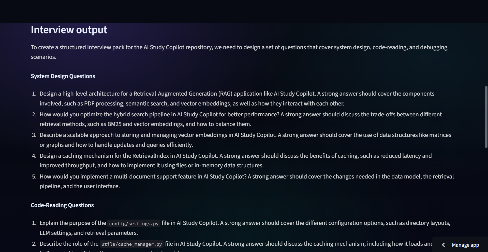

# RepoMind AI

AI-powered Repository Intelligence Platform that analyzes GitHub repositories, maps architecture, performs semantic code search, generates repository explanations, and creates interview preparation packs.

## Live Demo

**Streamlit App**

https://repomind-ai-ffwanuyiptjr68bq4lncub.streamlit.app

---

## Features

### Repository Analysis

* Clone public GitHub repositories
* Scan and index project files
* Extract repository structure
* Build searchable knowledge base

### Architecture Intelligence

* Dependency mapping
* Entry-point detection
* Internal module analysis
* Repository architecture overview

### Semantic Search

* FAISS vector database
* SentenceTransformer embeddings
* Similarity-based retrieval
* Context-aware search

### AI-Powered Explanations

* Architecture summaries
* File responsibility analysis
* Code purpose explanations
* Repository understanding

### Repository Q&A

Ask questions such as:

* Explain this architecture
* How does authentication work?
* What is the main entry point?
* Which file handles embeddings?

### Interview Pack Generator

Generate:

* System design questions
* Code-reading questions
* Debugging scenarios
* Repository-specific interview preparation

---

## Screenshots

### Home


### Architecture Analysis


### Repository Q&A


### Interview Pack



---

## Tech Stack

### Backend

* Python 3.11
* GitPython
* FAISS
* SentenceTransformers
* Groq LLM

### Frontend

* Streamlit

### AI Components

* Retrieval-Augmented Generation (RAG)
* Semantic Search
* Vector Embeddings
* Repository Intelligence

---

## Project Architecture

```text
GitHub Repository
        │
        ▼
 Clone Repository
        │
        ▼
 File Scanner
        │
        ▼
 Chunk Generator
        │
        ▼
 Embedding Model
        │
        ▼
 FAISS Index
        │
        ▼
 Semantic Retrieval
        │
        ▼
 Groq LLM
        │
        ▼
 AI Explanations / Q&A / Interview Pack
```

---

## Installation

### Clone Repository

```bash
git clone https://github.com/prince-builds/repomind-ai.git
cd repomind-ai
```

### Create Virtual Environment

```bash
python -m venv venv
```

### Activate Environment

```bash
venv\Scripts\activate
```

### Install Dependencies

```bash
pip install -r requirements.txt
```

### Configure Environment Variables

Create:

```bash
.env
```

Add:

```env
GROQ_API_KEY=your_groq_api_key
GITHUB_TOKEN=your_github_token
```

---

## Run Application

```bash
streamlit run app.py
```

---

## Folder Structure

```text
repomind/
├── architecture/
├── chunking/
├── embeddings/
├── explanations/
├── files/
├── ingestion/
├── llm/
├── parsing/
├── retrieval/
├── ui/
├── utils/
└── data/
```

---

## Future Improvements

* Multi-repository comparison
* Repository diagrams
* Export architecture reports
* Team collaboration features
* Persistent cloud indexing

---

## Author

Prince Yadav

B.Tech Artificial Intelligence

GitHub:
https://github.com/prince-builds

LinkedIn:
https://www.linkedin.com/in/prince-yadav

---

## License

MIT License
