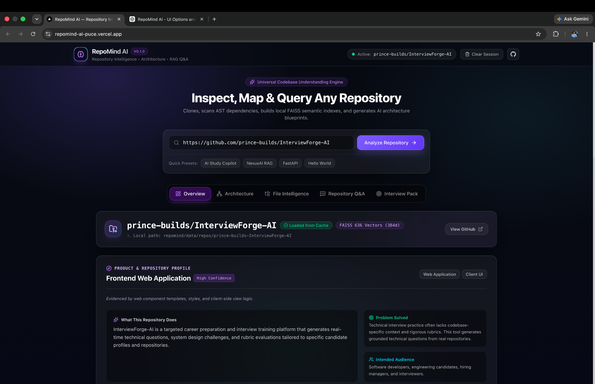
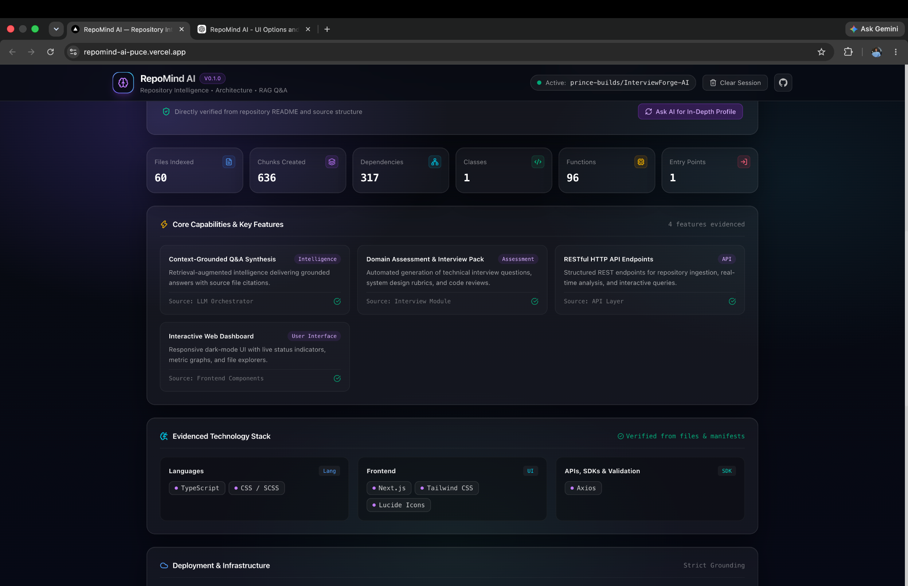
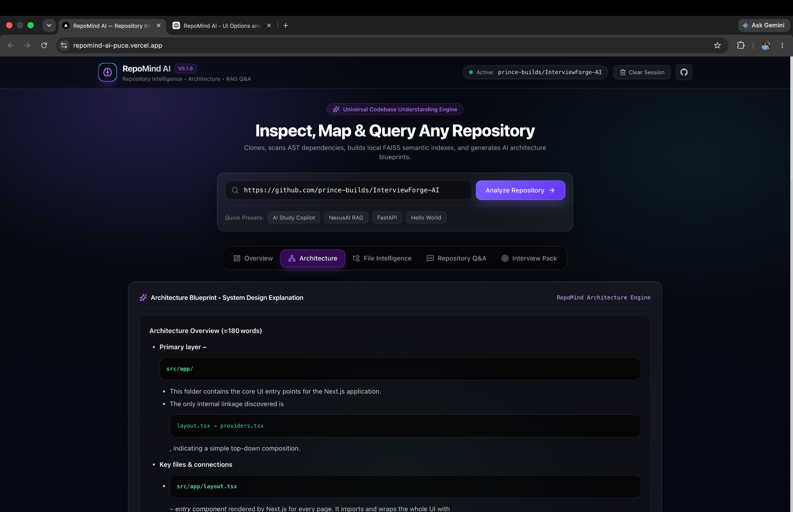
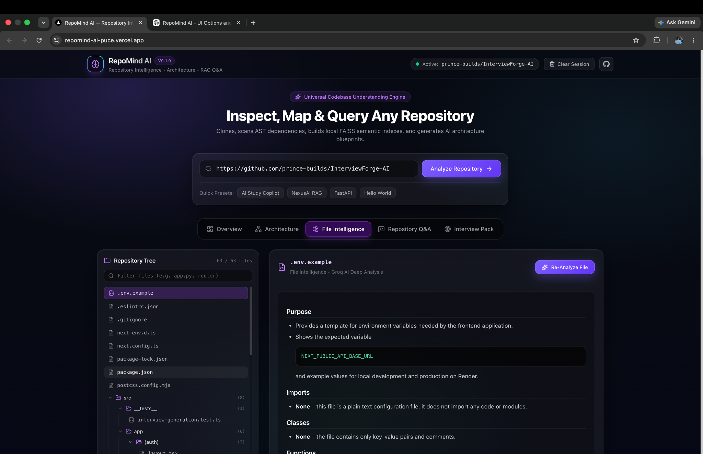
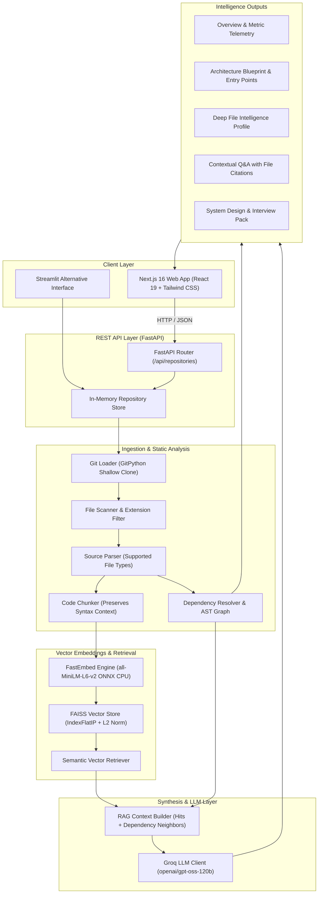

<div align="center">

# 🧠 RepoMind AI

### AI-Powered Repository Intelligence & Codebase Understanding Platform

**Inspect, map, semantically search, and understand any GitHub repository in seconds.**

[](https://repomind-ai-puce.vercel.app)
[](https://github.com/prince-builds/repomind-ai)
[](LICENSE)

<br/>

[](https://www.python.org/)
[](https://fastapi.tiangolo.com/)
[](https://nextjs.org/)
[](https://react.dev/)
[](https://www.typescriptlang.org/)
[](https://tailwindcss.com/)
[](https://github.com/qdrant/fastembed)
[](https://github.com/facebookresearch/faiss)
[](https://groq.com/)

<br/>



</div>

---

## 📌 Table of Contents

- [Overview](#-overview)
- [Key Features](#-key-features)
- [Product Walkthrough](#-product-walkthrough)
- [System Architecture & Data Flow](#-system-architecture--data-flow)
- [Technology Stack](#-technology-stack)
- [Repository Structure](#-repository-structure)
- [Installation & Local Setup](#-installation--local-setup)
- [Environment Configuration](#-environment-configuration)
- [Usage Guide](#-usage-guide)
- [REST API Reference](#-rest-api-reference)
- [Alternative Streamlit Interface](#-alternative-streamlit-interface)
- [Performance & Engineering Decisions](#-performance--engineering-decisions)
- [Current Limitations](#-current-limitations)
- [Roadmap](#-roadmap)
- [Author & License](#-author--license)

---

## 📖 Overview

**RepoMind AI** is a full-stack, developer-first repository intelligence platform engineered to eliminate codebase onboarding friction. Navigating an unfamiliar or complex code repository is often challenging: directory hierarchies are deep, entry points and internal dependencies are opaque, documentation is frequently outdated, and standard text search lacks semantic understanding of code context.

RepoMind AI automates the codebase discovery process:
1. **Clones & Filters**: Ingests public GitHub repositories and filters non-source artifacts.
2. **Parses & Resolves Dependencies**: Builds abstract syntax and import relationship graphs to identify entry points and hub modules.
3. **Embeds & Indexes**: Chunks source code and computes dense vector embeddings locally using **FastEmbed (ONNX Runtime CPU)** into an in-memory **FAISS** vector store.
4. **Context-Aware Reasoning**: Orchestrates **Retrieval-Augmented Generation (RAG)** powered by **Groq (`openai/gpt-oss-120b`)** to generate comprehensive architectural blueprints, per-file technical breakdowns, grounded Q&A with file citations, and technical interview preparation packs.

### Who Is RepoMind AI For?

- 👨‍💻 **Software Engineers**: Quickly understand architecture, conventions, and data flows when onboarding to new codebases.
- 🎓 **Engineering Candidates**: Prepare for repository-specific system design, code-reading, and debugging interview rounds.
- 👥 **Technical Interviewers & Reviewers**: Automatically generate codebase review checklists, rubric items, and architectural probing questions.
- 🛠️ **Open Source Contributors & Maintainers**: Provide incoming contributors with instant architectural summaries and file-level responsibilities.

---

## ✨ Key Features

| Feature | Description | Implemented Engine |
| :--- | :--- | :--- |
| **🚀 Repository Ingestion** | Shallow clones any public GitHub repository, traverses directory trees, and applies smart file filters to omit lockfiles, binaries, and build artifacts. | `GitPython` + `file_filter.py` |
| **🧩 Multi-Language Parsing & Chunking** | Parses code across Python, TypeScript, JavaScript, Go, Rust, Java, C/C++, Markdown, JSON, YAML, etc., creating clean chunks that preserve file boundaries. | `repomind.chunking` + `supported_types.py` |
| **⚡ FastEmbed ONNX Embeddings** | Generates 384-dimensional dense vectors locally using `sentence-transformers/all-MiniLM-L6-v2` via CPU-optimized ONNX runtime with single-thread tuning. | `fastembed` + `embedder.py` |
| **🔍 FAISS Semantic Retrieval** | Performs sub-millisecond inner-product (cosine similarity) vector searches across normalized chunk embeddings with linked metadata. | `faiss-cpu` + `vector_store.py` |
| **🗺️ Static Architecture Topology** | Resolves internal and external import dependencies, detects candidate entry points (`main.py`, `app.ts`, `server.js`), and highlights critical hub files. | `repomind.architecture` |
| **📄 Deep File Intelligence** | Produces dedicated per-file reports covering technical purpose, imports, class hierarchies, function signatures, data flow, interview questions, and refactor opportunities. | `repomind.files.file_intelligence` |
| **💬 RAG-Powered Repository Q&A** | Synthesizes retrieved semantic code chunks with static dependency graph context to answer arbitrary natural-language questions with explicit file citations. | `repomind.llm.explainer` + `Groq` |
| **🎯 Technical Interview Pack** | Generates system design challenges, code walkthroughs, debugging scenarios, and code review prompts grounded directly in the target codebase. | `backend.app.routers.interview` |
| **🎨 Modern Web Application** | High-performance dark-mode web application featuring glassmorphism cards, real-time analysis status, responsive tabs, and expandable code previews. | Next.js 16 + React 19 + Tailwind CSS |

---

## 📸 Product Walkthrough

### 1. Repository Overview & Architectural Metrics
Analyze any GitHub repository URL to receive immediate high-level telemetry, including scanned files, indexed chunks, detected classes/functions, entry points, and an AI-generated architectural executive summary.

<div align="center">
  
</div>

---

### 2. Architecture Blueprint & Dependency Graph
Inspect entry points, internal module relationships, external dependencies, and top-connected hub files to understand coupling and system topology before writing code.

<div align="center">
  
</div>

---

### 3. Deep File Intelligence
Browse the interactive file tree and select any individual file to generate an exhaustive technical profile detailing its role, imports, classes, functions, data flow, candidate interview questions, and potential improvements.

<div align="center">
  
</div>

---

## 🏗️ System Architecture & Data Flow

RepoMind AI is structured into decoupled frontend, REST API, parsing/ingestion, vector embedding, dependency graph, and LLM synthesis layers:


```mermaid
flowchart TD
    subgraph Client ["Client Layer"]
        UI["Next.js 16 Web App (React 19 + Tailwind CSS)"]
        StreamlitApp["Streamlit Alternative Interface"]
    end

    subgraph API ["REST API Layer (FastAPI)"]
        Router["FastAPI Router (/api/repositories)"]
        Store["In-Memory Repository Store"]
    end

    subgraph Ingestion ["Ingestion & Static Analysis"]
        GitLoader["Git Loader (GitPython Shallow Clone)"]
        Scanner["File Scanner & Extension Filter"]
        Parser["Source Parser (Supported File Types)"]
        Chunker["Code Chunker (Preserves Syntax Context)"]
        DepResolver["Dependency Resolver & AST Graph"]
    end

    subgraph VectorEngine ["Vector Embeddings & Retrieval"]
        Embedder["FastEmbed Engine (all-MiniLM-L6-v2 ONNX CPU)"]
        FAISSStore["FAISS Vector Store (IndexFlatIP + L2 Norm)"]
        Retriever["Semantic Vector Retriever"]
    end

    subgraph Reasoning ["Synthesis & LLM Layer"]
        RAGContext["RAG Context Builder (Hits + Dependency Neighbors)"]
        GroqClient["Groq LLM Client (openai/gpt-oss-120b)"]
    end

    subgraph Deliverables ["Intelligence Outputs"]
        OverviewOut["Overview & Metric Telemetry"]
        ArchOut["Architecture Blueprint & Entry Points"]
        FileIntelOut["Deep File Intelligence Profile"]
        QAOut["Contextual Q&A with File Citations"]
        InterviewOut["System Design & Interview Pack"]
    end

    UI -->|HTTP / JSON| Router
    StreamlitApp --> Store
    Router --> Store
    Store --> GitLoader
    GitLoader --> Scanner
    Scanner --> Parser
    Parser --> Chunker
    Parser --> DepResolver
    Chunker --> Embedder
    Embedder --> FAISSStore
    FAISSStore --> Retriever
    Retriever --> RAGContext
    DepResolver --> RAGContext
    RAGContext --> GroqClient
    GroqClient --> Deliverables
    DepResolver --> Deliverables
    Deliverables --> UI
```

### Architectural Layer Breakdown

1. **Frontend Layer (Next.js 16 + React 19)**:
   - Server and Client components built with Tailwind CSS v4 and Lucide icons.
   - Centralized API client (`frontend/src/lib/api.ts`) managing async timeouts, abort controllers, and error handling.
2. **REST API Layer (FastAPI + Uvicorn)**:
   - Asynchronous endpoints for repository analysis, overview queries, file tree browsing, single-file intelligence, RAG Q&A, and interview generation.
   - In-memory thread-safe `RepositoryStore` managing lifecycle states and cache eviction.
3. **Ingestion & Parsing Pipeline (`repomind/ingestion`, `repomind/parsing`)**:
   - Performs depth-1 shallow Git clones into `repomind/data/repos/`.
   - Filters binary formats, lockfiles, and virtual environments while parsing code files across 20+ extensions.
4. **Vector Embeddings & FAISS Store (`repomind/embeddings`, `repomind/retrieval`)**:
   - Chunks code into token-bounded segments.
   - Computes 384-dimensional embeddings via FastEmbed ONNX Runtime CPU (`sentence-transformers/all-MiniLM-L6-v2`).
   - Normalizes vectors and builds an in-memory `faiss.IndexFlatIP` index for cosine similarity ranking.
5. **Static Dependency Resolver (`repomind/architecture`)**:
   - Parses AST and regex import statements to compute internal/external dependency edges, entry-point candidates, and degree centrality.
6. **LLM Orchestration Layer (`repomind/llm`, `repomind/explanations`)**:
   - Assembles multi-source RAG context (semantic hits + static graph neighbors) and queries Groq API (`openai/gpt-oss-120b`) for rapid reasoning.

---

## 💻 Technology Stack

### Frontend
- **Framework**: [Next.js 16.3 (App Router)](https://nextjs.org/)
- **Core Library**: [React 19.2](https://react.dev/)
- **Language**: [TypeScript 5](https://www.typescriptlang.org/)
- **Styling**: [Tailwind CSS v4](https://tailwindcss.com/)
- **Icons**: [Lucide React](https://lucide.dev/)
- **Markdown Rendering**: [react-markdown](https://github.com/remarkjs/react-markdown) + [remark-gfm](https://github.com/remarkjs/remark-gfm)

### Backend
- **Runtime**: [Python 3.11+](https://www.python.org/)
- **Web Framework**: [FastAPI 0.110+](https://fastapi.tiangolo.com/)
- **ASGI Server**: [Uvicorn 0.28+](https://www.uvicorn.org/)
- **Validation & Schemas**: [Pydantic v2](https://docs.pydantic.dev/)
- **Repository Ingestion**: [GitPython 3.1+](https://gitpython.readthedocs.io/)

### AI, Embeddings & Vector Search
- **LLM Inference**: [Groq Cloud SDK](https://groq.com/) (`openai/gpt-oss-120b`)
- **Embedding Generation**: [FastEmbed](https://github.com/qdrant/fastembed) (`sentence-transformers/all-MiniLM-L6-v2` via ONNX Runtime CPU)
- **Vector Search Engine**: [FAISS-CPU 1.8+](https://github.com/facebookresearch/faiss) (In-Memory `IndexFlatIP`)
- **Context Builder**: Custom Multi-Neighbor RAG Context Assembler

### DevOps & Deployment
- **Containerization**: [Docker](https://www.docker.com/) (Multi-stage `python:3.11-slim`)
- **Frontend Hosting**: [Vercel](https://vercel.com/)
- **Testing**: [Pytest 8+](https://docs.pytest.org/)

---

## 📁 Repository Structure

```text
RepoMind-AI/
├── backend/                        # FastAPI REST API application
│   ├── app/
│   │   ├── routers/                # API route controllers
│   │   │   ├── architecture.py     # Dependency graph & hub endpoints
│   │   │   ├── files.py            # File tree & File Intelligence endpoints
│   │   │   ├── interview.py        # Interview Pack generation endpoint
│   │   │   ├── qa.py               # RAG semantic Q&A endpoint
│   │   │   └── repositories.py     # Ingest, overview & session endpoints
│   │   ├── schemas/                # Pydantic request/response models
│   │   ├── main.py                 # FastAPI application factory & CORS setup
│   │   └── store.py                # In-memory repository session cache
│   └── tests/
│       └── test_api.py             # Automated API integration tests
├── frontend/                       # Next.js 16 modern web interface
│   ├── src/
│   │   ├── app/                    # Next.js App Router (layout, page, styles)
│   │   ├── components/             # UI Tab components
│   │   │   ├── AnalyzeBar.tsx      # Repository input & progress bar
│   │   │   ├── ArchitectureTab.tsx # Dependency topology & entry points
│   │   │   ├── FilesTab.tsx        # File tree & File Intelligence viewer
│   │   │   ├── InterviewTab.tsx    # Interview Pack & review generator
│   │   │   ├── Navbar.tsx          # Application header & status pills
│   │   │   ├── OverviewTab.tsx     # Metrics, capabilities & chunk preview
│   │   │   ├── QATab.tsx           # Interactive RAG Q&A interface
│   │   │   └── RetrievedContext.tsx# Semantic chunk transparency card
│   │   └── lib/
│   │       ├── api.ts              # Typed API client with timeout management
│   │       └── types.ts            # Shared TypeScript interfaces
│   ├── package.json                # Frontend dependencies & scripts
│   └── tailwind.config.ts          # Tailwind styling configuration
├── repomind/                       # Core repository intelligence engine
│   ├── architecture/               # AST import resolution & dependency graph
│   ├── chunking/                   # Text chunking & boundary preservation
│   ├── embeddings/                 # FastEmbed ONNX vector generator
│   ├── explanations/               # LLM prompt orchestration
│   ├── files/                      # File tree hierarchy & file intelligence
│   ├── ingestion/                  # Git shallow clone & smart file filters
│   ├── llm/                        # Groq client wrapper & system prompts
│   ├── parsing/                    # Multi-language syntax parsers
│   ├── retrieval/                  # FAISS vector store & RAG context builder
│   ├── ui/                         # Streamlit fallback application
│   └── utils/                      # Settings & configuration management
├── docs/                           # Documentation and visual assets
│   └── readme-assets/              # High-resolution screenshots
├── scripts/                        # Verification & test utilities
├── app.py                          # Streamlit fallback entry point
├── Dockerfile                      # Production Docker container definition
├── requirements.txt                # Python backend dependencies
└── .env.example                    # Environment variable template
```

---

## ⚙️ Installation & Local Setup

### Prerequisites

Ensure you have the following installed on your machine:
- **Python**: `3.11` or higher
- **Node.js**: `18.0` or higher (with `npm`)
- **Git**: Installed and accessible in your system `PATH`
- **Groq API Key**: Obtain a free API key from the [Groq Console](https://console.groq.com/)

---

### Step 1: Clone the Repository

```bash
git clone https://github.com/prince-builds/repomind-ai.git
cd repomind-ai
```

---

### Step 2: Backend Setup (FastAPI)

1. **Create and activate a Python virtual environment:**

   *On macOS / Linux:*
   ```bash
   python3 -m venv venv
   source venv/bin/activate
   ```

   *On Windows (PowerShell):*
   ```powershell
   python -m venv venv
   .\venv\Scripts\Activate.ps1
   ```

2. **Install backend dependencies:**
   ```bash
   pip install -r requirements.txt
   ```

3. **Configure environment variables:**
   ```bash
   cp .env.example .env
   ```
   Open `.env` in your editor and add your Groq API key:
   ```env
   GROQ_API_KEY=gsk_your_actual_groq_api_key_here
   GROQ_MODEL=openai/gpt-oss-120b
   EMBEDDING_MODEL=all-MiniLM-L6-v2
   DATA_DIR=repomind/data
   CORS_ORIGINS=http://localhost:3000,http://127.0.0.1:3000
   ```

4. **Start the FastAPI backend server:**
   ```bash
   uvicorn backend.app.main:app --host 0.0.0.0 --port 8000 --reload
   ```
   *The REST API will be live at `http://localhost:8000` with interactive Swagger docs at `http://localhost:8000/docs`.*

---

### Step 3: Frontend Setup (Next.js)

1. **Navigate to the frontend directory:**
   ```bash
   cd frontend
   ```

2. **Install Node dependencies:**
   ```bash
   npm install
   ```

3. **Configure frontend environment variables:**
   Create `.env.local` in `frontend/`:
   ```env
   NEXT_PUBLIC_API_URL=http://localhost:8000
   ```

4. **Start the Next.js development server:**
   ```bash
   npm run dev
   ```
   *Open [http://localhost:3000](http://localhost:3000) in your browser to interact with RepoMind AI.*

---

## 🔐 Environment Configuration

| Variable | Scope | Default Value | Description |
| :--- | :--- | :--- | :--- |
| `GROQ_API_KEY` | Backend | *(Required)* | Groq Cloud API key used for all LLM reasoning. |
| `GROQ_MODEL` | Backend | `openai/gpt-oss-120b` | Target Groq model for completions and analysis. |
| `GITHUB_TOKEN` | Backend | `""` (Optional) | GitHub Personal Access Token to increase clone & API rate limits. |
| `EMBEDDING_MODEL` | Backend | `all-MiniLM-L6-v2` | Embedding model identifier passed to FastEmbed. |
| `DATA_DIR` | Backend | `repomind/data` | Directory where repository clones and local files are cached. |
| `CORS_ORIGINS` | Backend | `localhost:3000,127.0.0.1:3000` | Comma-separated list of allowed origins for CORS middleware. |
| `NEXT_PUBLIC_API_URL` | Frontend | `http://127.0.0.1:8000` | FastAPI backend URL consumed by the Next.js client. |

> [!WARNING]
> Never commit your `.env` or `.env.local` files to version control. Keep your `GROQ_API_KEY` confidential.

---

## 🧭 Usage Guide

```
1. Paste Repository URL  ──►  2. Analyze  ──►  3. Explore Intelligence Tabs
   (e.g., github.com/...)       (Ingest/FAISS)      (Overview / Arch / Files / Q&A / Interview)
```

1. **Enter Repository URL**: Open the application and paste any public GitHub repository URL (e.g., `https://github.com/fastapi/fastapi` or `https://github.com/prince-builds/repomind-ai`).
2. **Analyze**: Click **Analyze Repository**. RepoMind shallow clones the repo, builds the AST dependency network, embeds chunks with FastEmbed, and constructs the FAISS index.
3. **Explore Overview**: Review indexed file counts, total chunks, detected entry points, and AI architecture summary.
4. **Inspect Architecture**: View internal vs external import ratios, discovered entry points, and the most connected hub modules.
5. **Open File Intelligence**: Select any file from the interactive directory tree to generate an instant per-file audit (responsibilities, methods, data flows, and improvements).
6. **Ask Questions (Q&A)**: Query the codebase in natural language (e.g., *"How does authentication work?"*, *"Where is the vector store initialized?"*) to receive answers with chunk citations.
7. **Generate Interview Pack**: Select a template (System Design, Code Review, or Architecture Deep-Dive) and generate candidate interview rubrics with file citations.

---

## 📡 REST API Reference

The FastAPI backend exposes clean, fully typed endpoints. Interactive documentation is available at `http://localhost:8000/docs` (Swagger UI) and `http://localhost:8000/redoc` (ReDoc).

| Method | Endpoint | Description |
| :--- | :--- | :--- |
| `GET` | `/health` | Health check endpoint returning backend status and version. |
| `GET` | `/` | Root info endpoint with API metadata and documentation links. |
| `POST` | `/api/repositories/analyze` | Ingests, parses, chunks, embeds, and analyzes architecture for a GitHub repository URL. |
| `GET` | `/api/repositories/{repo_id}/overview` | Retrieves repository metrics, chunk previews, and AI architecture summary. |
| `GET` | `/api/repositories/{repo_id}/architecture` | Retrieves dependency graph data, entry points, and top-connected hub files. |
| `GET` | `/api/repositories/{repo_id}/files` | Retrieves directory hierarchy tree with optional substring query filtering. |
| `POST` | `/api/repositories/{repo_id}/files/analyze` | Generates structured File Intelligence for a specific file path via Groq AI. |
| `POST` | `/api/repositories/{repo_id}/qa` | Performs semantic search and RAG synthesis to answer repository questions. |
| `POST` | `/api/repositories/{repo_id}/interview` | Generates a structured interview or code review pack grounded in repository context. |
| `POST` | `/api/repositories/{repo_id}/clear` | Clears repository session from active memory and optionally deletes disk cache. |

---

## 🎈 Alternative Streamlit Interface

In addition to the modern Next.js 16 web application, RepoMind AI includes a standalone [Streamlit](https://streamlit.io/) interface retained as an alternative and fallback testing UI.

- 🌐 **Live Streamlit App**: [https://repomind-ai-ffwanuyiptjr68bq4lncub.streamlit.app/](https://repomind-ai-ffwanuyiptjr68bq4lncub.streamlit.app/)
- 💻 **Run Streamlit Locally**:
  ```bash
  streamlit run app.py
  ```

---

## 🔬 Performance & Engineering Decisions

- **FastEmbed vs Heavy Transformer Runtimes**: FastEmbed runs ONNX-quantized embedding models (`all-MiniLM-L6-v2`) on CPU with `threads=1`, eliminating heavyweight PyTorch GPU dependencies and drastically reducing memory consumption in containerized hosting.
- **Controlled Batch Embedding**: Text chunks are embedded in batches of 16 to avoid RAM allocation spikes when processing large repositories.
- **In-Memory FAISS `IndexFlatIP`**: Embeddings and queries are L2-normalized upon insertion and search, enabling inner product computation to perform exact cosine similarity retrieval in sub-millisecond time.
- **Dual RAG Context Expansion**: In addition to semantic similarity hits, the context builder optionally expands file context using static dependency graph neighbors, giving the LLM visibility into callers and imported modules.
- **Session Caching & Eviction**: Analyzed repositories are cached in memory for rapid multi-tab navigation, with dedicated `/clear` endpoints to release RAM when switching repositories.
- **Configurable Timeout Management**: The frontend HTTP client employs custom abort controllers (150 seconds for cloning/indexing, 60 seconds for queries) with user-friendly retry states.

---

## ⚠️ Current Limitations

- **Public Repositories**: Repository cloning currently supports public GitHub repositories (or private repositories when a valid `GITHUB_TOKEN` is configured).
- **In-Memory Session Persistence**: Repository indexes and sessions reside in application memory; restarting the backend requires re-analyzing repositories not present on disk.
- **Repository Size Bounds**: Very large mono-repositories (exceeding hundreds of thousands of lines) will experience higher indexing times and memory requirements during chunk embedding.
- **Rate Limits**: Groq LLM completions are subject to upstream Groq API rate limits and token quotas.

---

## 🗺️ Roadmap

- [ ] **Persistent Vector Database**: Support external vector databases (Qdrant, Milvus, or Pinecone) for persistent cloud indexing.
- [ ] **Asynchronous Task Queue**: Background repository ingestion with Celery/Redis and real-time WebSocket progress streaming.
- [ ] **Interactive Visual Graph**: Visual graph explorer built with React Flow to interactively traverse dependency topologies.
- [ ] **Multi-Repository Comparison**: Side-by-side architecture comparison and API diff analysis across multiple repositories.
- [ ] **Exportable Architecture Reports**: Downloadable audit reports and interview packs in Markdown and PDF format.

---

## 👨‍💻 Author & License

Developed with ❤️ by **Prince Yadav**<br/>
- **GitHub**: [@prince-builds](https://github.com/prince-builds)<br/>
- **LinkedIn**: [linkedin.com/in/princeyadavtech](https://www.linkedin.com/in/princeyadavtech)

This project is open-source and licensed under the **MIT License**.
